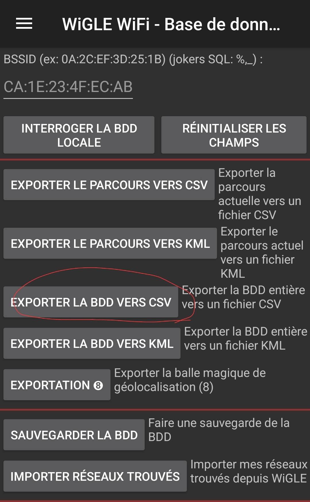
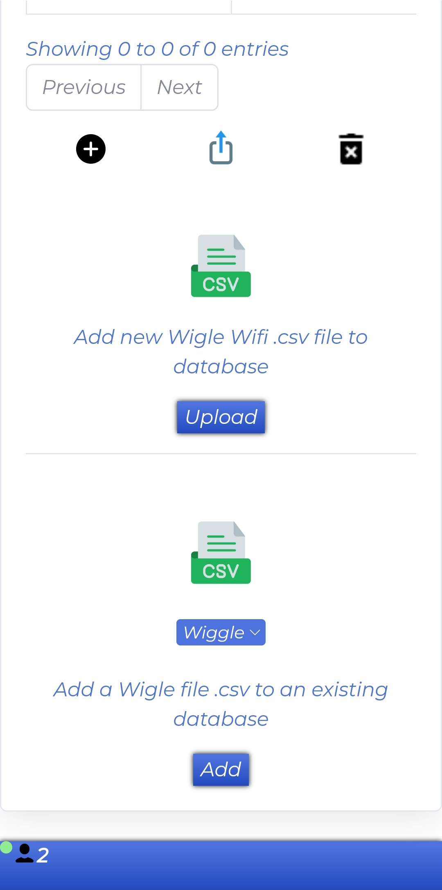

<p align="center">
<a href="https://github.com/Ignitetch/AdvPhishing/releases"></a>  
</p>
<p align="center">
  
</p>
<h1 align="center">Wifi-Map</h1>
<p align="center">
  
  
  
 
</p>
<p align="center">
  
  
  
</p>
<h2 align="center">Observe your wifi capture with Wigle on a Google map and personalized streetview</h2>
<p align="center">
  
</p>

**`First install nodejs and npm`**

```
$ git clone https://github.com/Lucstay11/Wifi-Map;cd Wifi-Map
```
```
$ npm i csv csv-parser express express-fileupload path socket.io
```


**`Start App`**

```
/Wifi-Map
$ node app.js
```

<i align="center">Explore <b>WiFi</b> around the world in real time</i>

<p align="center">
  
   
</p>

<i align="center">Export your database in CSV format on the Wigle application and then import it on the  <b>wifi map</b>!</i>

<p align="center">
  
   
</p>
